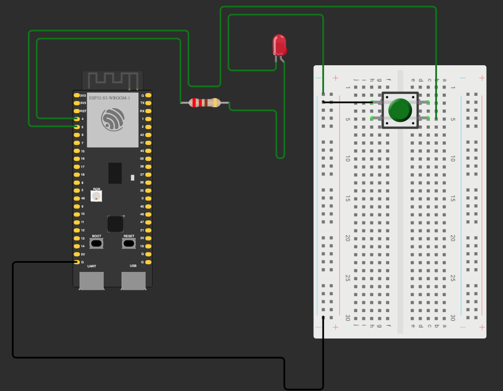

# ESP32 Button LED Toggle

This project is a simple ESP32-S3 button and LED example using Wokwi.

The ESP32 reads a pushbutton on GPIO5 and toggles an LED on GPIO4.

Each button press changes the LED state:

```txt
First press  -> LED ON
Second press -> LED OFF
Third press  -> LED ON
```

## Components

```txt
ESP32-S3 DevKitC-1
Half breadboard
Pushbutton
LED
220 ohm resistor
Jumper wires
```

## Pins

```txt
GPIO4 = LED output
GPIO5 = button input
GND   = ground
```

## Circuit

LED:

```txt
ESP32 GPIO4 -> resistor -> LED anode
LED cathode -> GND
```

Button:

```txt
ESP32 GPIO5 -> button -> GND
```

The button uses `INPUT_PULLUP`.

That means the logic is reversed:

```txt
HIGH = released
LOW  = pressed
```

So the code detects a button press when GPIO5 reads `LOW`.

## Breadboard note

The pushbutton must be placed across the middle gap of the breadboard.

One side of the button goes to GPIO5.

The opposite side goes to GND.

When the button is pressed, GPIO5 connects to GND and reads `LOW`.

## Debounce

Real buttons can bounce when pressed or released.

This means the signal may quickly jump between HIGH and LOW.

To avoid false presses, the code waits 50 milliseconds before accepting the button state.

```cpp
const unsigned long DEBOUNCE_MS = 50;
```

## main.cpp

```cpp
#include <Arduino.h>

#define LED_PIN 4
#define BUTTON_PIN 5
#define BAUD_RATE 115200

const unsigned long DEBOUNCE_MS = 50;

int ledState = LOW;
int currentButtonState = HIGH;
int lastButtonState = HIGH;
unsigned long lastDebounceMillis = 0;

void setup() {
  Serial.begin(BAUD_RATE);

  pinMode(BUTTON_PIN, INPUT_PULLUP);
  pinMode(LED_PIN, OUTPUT);

  Serial.println("App started ");
}

void loop() {
  int rawReading = digitalRead(BUTTON_PIN);

  if (rawReading != lastButtonState) {
    lastDebounceMillis = millis();
    lastButtonState = rawReading;
  }

  if (millis() - lastDebounceMillis >= DEBOUNCE_MS) {
    if (rawReading != currentButtonState) {
      currentButtonState = rawReading;

      if (currentButtonState == LOW) {
        Serial.println("Button Pressed ");

        ledState = !ledState;
        digitalWrite(LED_PIN, ledState);
      } else if (currentButtonState == HIGH) {
        Serial.println("Button Released ");
      }
    }
  }
}
```

## Wokwi diagram.json

```json
{
  "version": 1,
  "author": "Suraj Maurya",
  "editor": "wokwi",
  "parts": [
    {
      "type": "wokwi-breadboard-half",
      "id": "bb1",
      "top": 178.5,
      "left": 89.7,
      "rotate": 90,
      "attrs": {}
    },
    {
      "type": "board-esp32-s3-devkitc-1",
      "id": "esp",
      "top": 124.62,
      "left": -139.43,
      "attrs": {}
    },
    {
      "type": "wokwi-led",
      "id": "led1",
      "top": 73.2,
      "left": 90.2,
      "attrs": { "color": "red" }
    },
    {
      "type": "wokwi-pushbutton",
      "id": "btn1",
      "top": 150.2,
      "left": 220.8,
      "attrs": { "color": "green", "xray": "1" }
    },
    {
      "type": "wokwi-resistor",
      "id": "r1",
      "top": 157.55,
      "left": -9.6,
      "attrs": { "value": "220" }
    }
  ],
  "connections": [
    ["esp:TX", "$serialMonitor:RX", "", []],
    ["esp:RX", "$serialMonitor:TX", "", []],
    ["esp:4", "r1:1", "green", ["h-48.05", "v-96", "h172.8", "v19.2"]],
    [
      "esp:GND.1",
      "bb1:bn.25",
      "black",
      ["h-76.85", "v115.2", "h326.4", "v38.4", "h48"]
    ],
    ["r1:2", "led1:A", "green", ["v9.6", "h56.4", "v57.6", "h-38.4"]],
    ["led1:C", "bb1:bn.1", "green", ["v9.6", "h-57.2", "v-67.2", "h105.6"]],
    [
      "esp:5",
      "bb1:5t.b",
      "green",
      ["h-57.65", "v-115.2", "h192", "v67.2", "h38.4", "v-96", "h259.2"]
    ],
    ["btn1:1.l", "bb1:bn.2", "black", ["h0"]],
    ["btn1:1.l", "bb1:3b.h", "", ["$bb"]],
    ["btn1:2.l", "bb1:5b.h", "", ["$bb"]],
    ["btn1:1.r", "bb1:3t.c", "", ["$bb"]],
    ["btn1:2.r", "bb1:5t.c", "", ["$bb"]]
  ],
  "dependencies": {}
}
```



## Run

Make sure PlatformIO is installed.

From the project folder, run:

```bash
pio run -t clean
pio run
```

Then start the Wokwi simulation.

Open the Serial Monitor.

You should see:

```txt
App started
```

When you press the button:

```txt
Button Pressed
```

When you release it:

```txt
Button Released
```

## Summary

This project shows how to read a button using `INPUT_PULLUP`.

The important rule is:

```txt
HIGH = released
LOW  = pressed
```

The code debounces the button and toggles the LED only when a clean button press is detected.
